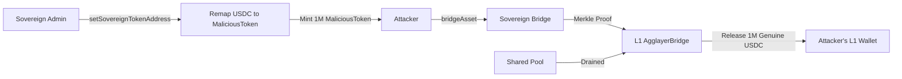

# 📦 Agglayer Bridge Security Analysis
## ☢️ [CRITICAL] Global Liquidity Drain via Sovereign Asset Remapping

---

## 🛠️ Executive Summary
```text
AgglayerBridgeL2.sol & AgglayerBridge.sol
│
├── 🔍 Issue: Arbitrary Token Remapping (bridgeManager)
├── 🧩 Complexity: Low (Admin Access)
└── 🚨 Impact: TOTAL LOSS OF FUNDS (Shared Liquidity Pool Drain)
```

## Summary
The Agglayer architecture utilizes a shared liquidity pool on L1 to facilitate seamless cross-chain asset transfers. However, the `AgglayerBridgeL2` implementation for sovereign chains allows the `bridgeManager` to arbitrarily map global asset identifiers (TokenInfoHash) to local contract addresses. This creates a fatal trust dependency: a single compromised sovereign chain can remap a high-value L1 asset (e.g., USDC) to a malicious local contract, mint "counterfeit" assets, and bridge them back to L1 to drain the genuine assets from the shared pool.

## Finding Description
The vulnerability stems from the interaction between the `bridgeManager`'s power and the shared nature of the L1 liquidity vault.

### 🧩 Technical Trace
1. **Remapping**: The `bridgeManager` of a sovereign chain calls `_setSovereignTokenAddress(originNetwork=0, originTokenAddress=USDC_L1_ADDR, sovereignTokenAddress=MALICIOUS_TOKEN)`.
2. **Counterfeiting**: The malicious sovereign chain "prints" 1,000,000 `MALICIOUS_TOKEN`.
3. **Bridging Out**: The attacker calls `bridgeAsset(token=MALICIOUS_TOKEN, amount=1,000,000)`.
4. **L1 Verification**: The L1 `AgglayerBridge` receives a Merkle proof for a leaf with `originTokenAddress=USDC_L1_ADDR` and `amount=1,000,000`.
5. **Drain**: The L1 bridge releases 1,000,000 **genuine USDC** to the attacker's L1 address.

### 📊 Attack Flow Diagram


## Impact Explanation
- **Impact: Critical**. This is a **Systemic Contagion Risk**. The security of the *entire* Agglayer is reduced to the security of its *weakest* sovereign chain.
- **Financial Loss**: An attacker can drain all supported ERC20 tokens and Ether from the L1 bridge.

## Likelihood Explanation
- **Likelihood: Medium/High**. While the `bridgeManager` is intended to be a trusted role (e.g., a DAO), the Agglayer's value proposition is "Shared Liquidity." Sharing liquidity with sovereign chains that have unilateral control over asset mapping is fundamentally insecure unless there is an L1-enforced invariant.

## Proof of Concept
The vulnerability is evident in `AgglayerBridgeL2.sol`:
```solidity
518:         tokenInfoToWrappedToken[tokenInfoHash] = sovereignTokenAddress;
521:         wrappedTokenToTokenInfo[sovereignTokenAddress] = TokenInformation(
522:             originNetwork,
523:             originTokenAddress
524:         );
```
There are no checks ensuring that `sovereignTokenAddress` is a valid, immutable wrapper. The `bridgeManager` can update these mappings at any time.

## Recommendation
Implement a **Cross-Chain Asset Registry** on L1 that strictly defines which `sovereignTokenAddress` is allowed for each `originTokenAddress`. Sovereign chains should not be able to unilaterally change these mappings without L1 consensus or an Agglayer-wide governance vote.
